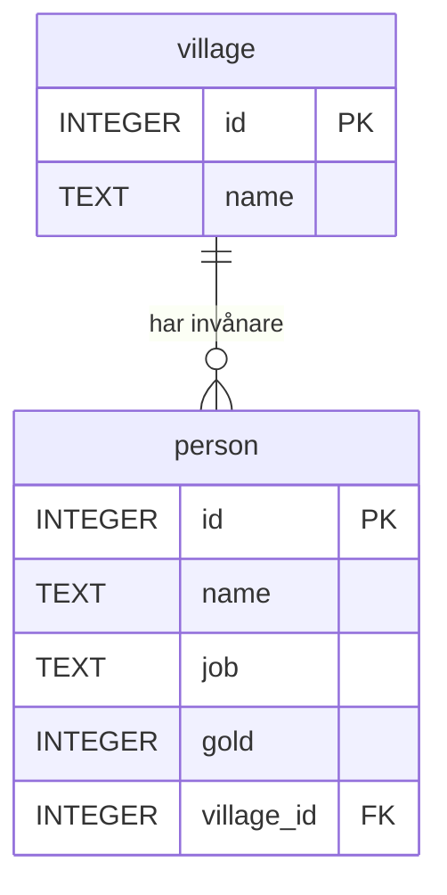
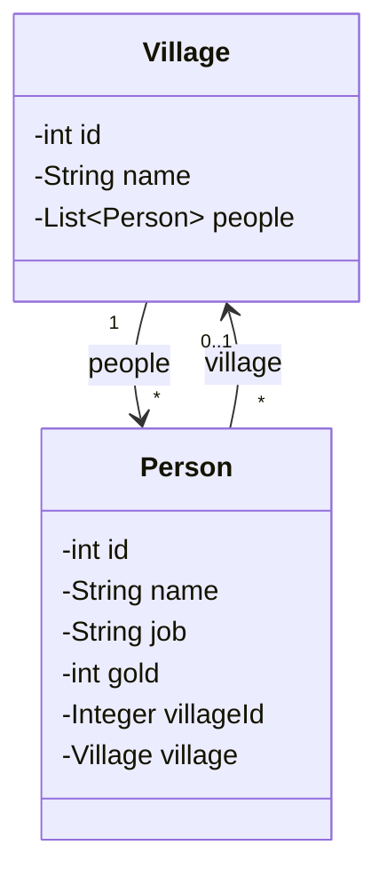

# Från tabell till klass

Du har skrivit klasser. Du har skapat objekt och lagt dem i listor.

Då kan du redan mer om databaser än du tror. En tabell och en klass beskriver nämligen nästan samma sak: *hur en sak ser ut*. Den här sidan går igenom hur en tabell är uppbyggd, del för del, och visar sedan vad varje del motsvarar i Java.

*Exemplen använder [övningsdatan](ovningsdata.md).*

## Hur en tabell är uppbyggd

Så här skapas tabellen `person`:

```sql
CREATE TABLE person (
    id         INTEGER PRIMARY KEY,
    name       TEXT NOT NULL,
    job        TEXT,
    gold       INTEGER NOT NULL DEFAULT 0,
    village_id INTEGER REFERENCES village(id)
);
```

Vi tar den bit för bit.

### Tabellen

`person` är tabellens namn. En tabell beskriver **en sorts sak**: personer, ordrar eller produkter. Allt i tabellen handlar om just den saken.

### Kolumner

`id`, `name`, `job`, `gold` och `village_id` är tabellens **kolumner**. En kolumn är en egenskap som varje rad har.

Varje kolumn har tre delar:

| Del | Exempel | Betyder |
|---|---|---|
| Namn | `gold` | vad egenskapen heter |
| Datatyp | `INTEGER` | vilken sorts värde den får innehålla |
| Regler | `NOT NULL DEFAULT 0` | vilka värden som är tillåtna, och vad som gäller om inget anges |

### Datatyper

| SQLite | MySQL / PostgreSQL | Innehåller |
|---|---|---|
| `INTEGER` | `INT` | heltal |
| `REAL` | `DOUBLE`, `DECIMAL(10,2)` | decimaltal |
| `TEXT` | `VARCHAR(100)` | text |
| `INTEGER` (0/1) | `BOOLEAN` | sant eller falskt |
| `TEXT` | `DATE`, `TIMESTAMP` | datum och tid |

SQLite har få och generösa typer. Andra databaser har fler och är strängare, och där bestämmer du ofta också en maxlängd, t.ex. `VARCHAR(100)`.

### Regler (constraints)

| Regel | Betyder |
|---|---|
| `PRIMARY KEY` | unik för varje rad, och identifierar raden |
| `NOT NULL` | måste ha ett värde |
| `DEFAULT 0` | blir 0 om du inte anger något |
| `REFERENCES village(id)` | måste peka på ett `id` som finns i `village` |
| `UNIQUE` | inga två rader får ha samma värde |

Reglerna är tabellens skydd. Även om koden som skriver till databasen har en bugg kan den inte lägga in en person utan namn. Mer om reglerna finns i [Constraints](../constraints.md).

### Rader

| id | name | job | gold | village_id |
|---|---|---|---|---|
| 1 | Anna | baker | 120 | 1 |
| 2 | Bertil | smith | 300 | 2 |
| 3 | Cissi | baker | 80 | 1 |
| 4 | David | pilot | 500 | NULL |
| 5 | Eva | merchant | 250 | 2 |

Varje **rad** är en person. `CREATE TABLE` bestämmer *hur* en rad ska se ut, och `INSERT` lägger till rader. Tabellen ovan har fem.

### Nycklar och relationer

`id` är **primärnyckeln** och identifierar varje rad. `village_id` är en **främmande nyckel** som pekar på primärnyckeln i en annan tabell:



Symbolerna på linjen betyder att **en** by kan ha **noll eller flera** personer, och att varje person hör till **högst en** by. Det kallas en **en-till-många-relation**.

---

## Samma sak i Java

Nu kommer bron. Så här ser `person` ut som en klass:

```java
public class Person {
    private int id;
    private String name;
    private String job;
    private int gold = 0;
    private Integer villageId;

    public Person(String name) {
        this.name = Objects.requireNonNull(name, "name får inte vara null");
    }

    public int getId() { return id; }
    public String getName() { return name; }
    public String getJob() { return job; }
    public int getGold() { return gold; }
    public Integer getVillageId() { return villageId; }
}
```

Lägg dem bredvid varandra:

| SQL | Java | Kommentar |
|---|---|---|
| `CREATE TABLE person` | `public class Person` | ritningen |
| `id INTEGER PRIMARY KEY` | `private int id;` | identiteten |
| `name TEXT NOT NULL` | `String name` + `Objects.requireNonNull` i konstruktorn | måste anges |
| `job TEXT` | `private String job;` | får vara `null` |
| `gold INTEGER NOT NULL DEFAULT 0` | `private int gold = 0;` | standardvärde |
| `village_id INTEGER REFERENCES ...` | `private Integer villageId;` | pekar på en by, eller ingen |

### Hela kartan

| I databasen | I Java |
|---|---|
| tabell | klass |
| kolumn | fält, med getter och setter |
| datatyp | Java-typ |
| rad | objekt, alltså en instans av klassen |
| alla rader i tabellen | `List<Person>` |
| `CREATE TABLE` | att skriva klassen |
| `INSERT` | `new Person(...)` och `people.add(...)` |
| `NOT NULL` | en primitiv typ (`int`), eller en kontroll i konstruktorn |
| `NULL` tillåtet | en referenstyp: `String`, `Integer` |
| `DEFAULT` | ett startvärde: `= 0` |
| primärnyckel | `id` |
| främmande nyckel | `villageId`, plus en referens till objektet |

### Datatyperna

| SQL | Java | Kan vara `null`? |
|---|---|---|
| `INTEGER` / `INT` | `int` / `Integer` (eller `long` / `Long`) | bara `Integer` |
| `DOUBLE` | `double` / `Double` | bara `Double` |
| `DECIMAL(10,2)` | `BigDecimal`, som du ska använda för pengar | ja |
| `TEXT` / `VARCHAR` | `String` | ja |
| `BOOLEAN` | `boolean` / `Boolean` | bara `Boolean` |
| `DATE` / `TIMESTAMP` | `LocalDate` / `LocalDateTime` | ja |

Här finns en viktig skillnad mot många andra språk. I Java kan en **primitiv typ** (`int`, `double`, `boolean`) aldrig vara `null`. Vill du kunna representera `NULL` från databasen använder du **wrapper-klassen**: `Integer`, `Double` eller `Boolean`.

Det är därför `gold` är `int` (`NOT NULL`) men `villageId` är `Integer` (får vara `NULL`).

### En rad är ett objekt

Raden

| id | name | job | gold | village_id |
|---|---|---|---|---|
| 1 | Anna | baker | 120 | 1 |

är samma sak som objektet

```java
Person anna = new Person(1, "Anna", "baker", 120, 1);
```

och hela tabellen är en lista:

```java
List<Person> people = List.of(
    new Person(1, "Anna",   "baker",    120, 1),
    new Person(2, "Bertil", "smith",    300, 2),
    new Person(3, "Cissi",  "baker",     80, 1),
    new Person(4, "David",  "pilot",    500, null),
    new Person(5, "Eva",    "merchant", 250, 2));
```

Konstruktorn med alla fem värdena ser ut så här:

```java
public Person(int id, String name, String job, int gold, Integer villageId) {
    this(name);
    this.id = id;
    this.job = job;
    this.gold = gold;
    this.villageId = villageId;
}
```

### `NOT NULL` och `requireNonNull`

```java
Person nils = new Person("Nils");
// gold = 0, job = null, villageId = null

Person ingen = new Person(null);
// NullPointerException: name får inte vara null
```

Det är samma beteende som i databasen. En kolumn med `DEFAULT` får sitt standardvärde, en kolumn som tillåter `NULL` blir `null`, och en `NOT NULL`-kolumn utan standardvärde måste du fylla i.

Java har inget nyckelord som tvingar fram ett värde när du kompilerar. Därför görs kontrollen i konstruktorn, och felet kommer när programmet **körs**. Precis som i databasen.

**Gammal stil:**

```java
// En klass med fält, konstruktor, getters och toString/equals/hashCode
public class PersonRow {
    private final int id;
    private final String name;

    public PersonRow(int id, String name) {
        this.id = id;
        this.name = name;
    }

    public int getId() { return id; }
    public String getName() { return name; }
    // ... plus equals, hashCode och toString
}
```

**Modern stil (Java 16+):**

```java
// En record: samma sak på en rad, med equals, hashCode och toString inbyggda
public record PersonRow(int id, String name, String job, int gold, Integer villageId) { }
```

En `record` passar perfekt för en rad som du bara ska **läsa**, t.ex. resultatet av en `SELECT`. Den går inte att ändra efter att den har skapats. För data som ska kunna ändras, och för entiteter i JPA, används vanliga klasser. Läs mer i [Record i Java](../../datastructures/record.md).

### Främmande nyckel och navigation

I databasen pekar `village_id` på en by med ett **tal**. I Java kan ett objekt peka på ett annat objekt direkt:

```java
public class Village {
    private int id;
    private String name;
    private List<Person> people = new ArrayList<>();
    // konstruktor och getters
}

public class Person {
    // ... fälten ovan, plus:
    private Village village;

    public Village getVillage() { return village; }
    public void setVillage(Village village) { this.village = village; }
}
```



- `villageId` är den främmande nyckeln, precis som i tabellen
- `village` är en referens till själva by-objektet, så att du kan skriva `anna.getVillage().getName()`
- `people` i `Village` är andra hållet: alla personer i byn

I databasen finns bara `village_id`. Där behövs en [JOIN](join.md) för att gå från en person till byns namn. I Java följer du bara referensen.

## SQL och Streams

När tabellen är en lista är frågorna nästan samma sak. Här är SQL-frågor från de andra sidorna, översatta till Java Streams:

| SQL | Java Streams |
|---|---|
| `SELECT name FROM person` | `people.stream().map(Person::getName)` |
| `WHERE gold >= 250` | `.filter(p -> p.getGold() >= 250)` |
| `ORDER BY gold DESC LIMIT 3` | `.sorted(Comparator.comparingInt(Person::getGold).reversed()).limit(3)` |
| `SELECT COUNT(*) ... WHERE job = 'baker'` | `.filter(p -> "baker".equals(p.getJob())).count()` |
| `GROUP BY job` | `.collect(Collectors.groupingBy(Person::getJob))` |
| `JOIN village ON ...` | ett uppslag i en `Map<Integer, Village>` |

```java
List<String> rich = people.stream()
    .filter(p -> p.getGold() >= 250)
    .map(Person::getName)
    .toList();
// [Bertil, David, Eva], exakt som i SQL
```

Ordningen skiljer sig lite. I SQL skriver du `SELECT` först, men med Streams kommer `map` efter `filter`. Streams följer alltså samma ordning som databasen faktiskt **kör** frågan i (se [översikten](index.md#i-vilken-ordning-kör-databasen-frågan)).

Lägg också märke till `"baker".equals(p.getJob())` i stället för `p.getJob().equals("baker")`. Om `job` är `null` ger det senare en `NullPointerException`, men det förra ger bara `false`.

## 💡 Där liknelsen tar slut

En tabell och en klass är lika, men inte identiska. Här är skillnaderna som brukar ställa till det.

### `NULL` är inte `null`

Vilka bor **inte** i by 2?

```sql
SELECT name FROM person WHERE village_id <> 2;
-- Anna, Cissi
```

SQL ger Anna och Cissi. David saknas! Hans `village_id` är `NULL`, och `NULL <> 2` är *okänt*, inte sant. `WHERE` släpper bara igenom det som är sant. Läs mer under `NULL` på sidan [WHERE](where.md).

Samma fråga i Java:

```java
people.stream()
    .filter(p -> p.getVillageId() != 2)
    .map(Person::getName)
    .toList();
// NullPointerException!
```

Java **kraschar**. `getVillageId()` returnerar ett `Integer`, och för att jämföra med `2` packar Java upp det till en `int`. När värdet är `null` går det inte.

Med `Objects.equals` fungerar det:

```java
people.stream()
    .filter(p -> !Objects.equals(p.getVillageId(), 2))
    .map(Person::getName)
    .toList();
// [Anna, Cissi, David]
```

Nu kommer David med, eftersom `Objects.equals(null, 2)` är `false`. Det är alltså **tre olika** beteenden:

| | Svar för David |
|---|---|
| SQL: `village_id <> 2` | *okänt*, så han filtreras bort |
| Java: `p.getVillageId() != 2` | `NullPointerException` |
| Java: `!Objects.equals(p.getVillageId(), 2)` | `true`, så han kommer med |

Det är värt att komma ihåg varje gång data går mellan Java och en databas.

### En tabell har ingen ordning

En `List<Person>` har en ordning: Anna är på index 0. En tabell har det inte. Raderna kommer i den ordning databasen vill, om du inte skriver [ORDER BY](order-by.md).

### En klass kan göra saker

```java
public boolean canAfford(int price) {
    return gold >= price;
}
```

En klass har **beteende**: metoder, validering och logik. En tabell har bara **data**. Tabellen säger hur en person *ser ut*, aldrig vad en person *gör*.

### Många-till-många kräver en extra tabell

Säg att en person kan ha många verktyg, och att ett verktyg kan delas av många personer. I Java är det enkelt:

```java
private List<Tool> tools = new ArrayList<>();    // i Person
private List<Person> owners = new ArrayList<>(); // i Tool
```

En kolumn i en tabell kan bara innehålla **ett** värde. Därför behövs en tredje tabell som bara håller ihop paren:

```sql
CREATE TABLE person_tool (
    person_id INTEGER REFERENCES person(id),
    tool_id   INTEGER REFERENCES tool(id),
    PRIMARY KEY (person_id, tool_id)
);
```

Den kallas **kopplingstabell** (junction table). Den har ingen motsvarighet som egen klass i Java, men den behövs alltid i databasen.

### Arv finns inte

En klass kan ärva från en annan. En tabell kan det inte. Det finns sätt att lagra arv i databaser, men inget av dem är lika enkelt som `class Baker extends Person`.

## Det här är vad en ORM gör

Allt på den här sidan, alltså att översätta mellan tabeller och klasser, rader och objekt, och SQL och kod, är precis vad en **ORM** (Object-Relational Mapper) gör åt dig. I Java heter standarden **JPA**, och den vanligaste implementationen är **Hibernate**.

Du skriver klasserna och märker dem med annotationer som `@Entity` och `@Id`, och Hibernate sköter tabellerna och SQL:en. Utan ORM använder du **JDBC** direkt: du skriver SQL:en själv och läser in raderna till objekt för hand.

Men det är fortfarande tabeller och SQL under ytan, och därför är det värt att förstå båda sidorna.

### Clean Code: tabell och klass

> Så här håller du de två världarna i takt.

```java
// ❌ Typerna stämmer inte med tabellen
public class Person {
    private String id;        // id är ett heltal
    private String name;      // NOT NULL, men inget hindrar null
    private double gold;      // tabellen har heltal
    private int villageId;    // David har ingen by. Vad blir det?
}
```

```java
// ✅ Klassen säger samma sak som tabellen
public class Person {
    private int id;
    private String name;      // kontrolleras i konstruktorn
    private String job;
    private int gold = 0;
    private Integer villageId;
}
```

- **Samma regler på båda sidor.** `NOT NULL` blir en primitiv typ eller en kontroll i konstruktorn, och tillåtet `NULL` blir en referenstyp som `Integer`.
- **Samma datatyp.** Ett heltal i databasen ska inte bli `String` eller `double` i koden.
- **`BigDecimal` för pengar**, aldrig `double`
- **Namnkonventioner:** `snake_case` är vanligt i databaser (`village_id`), och `camelCase` i Java (`villageId`). En ORM översätter mellan dem.

> 💬 *Det här är hur jag brukar göra. Vissa team använder camelCase även i databasen, och det fungerar lika bra. Det viktiga är att det är konsekvent.*

## Vanliga misstag

| Misstag | Vad händer? | Gör så här i stället |
|---|---|---|
| `int villageId` när kolumnen tillåter `NULL` | `NULL` blir `0` vid inläsning med JDBC, och du kan inte se skillnad | `Integer villageId` |
| `p.getVillageId() != 2` när värdet kan vara `null` | `NullPointerException` | `!Objects.equals(p.getVillageId(), 2)` |
| `p.getJob().equals("baker")` | `NullPointerException` när `job` är `null` | `"baker".equals(p.getJob())` |
| `double` för pengar | Avrundningsfel: `0.1 + 0.2` blir `0.30000000000000004` | `BigDecimal` |
| Tro att `NULL` i SQL fungerar som `null` i Java | Rader med `NULL` försvinner i `WHERE` | `IS NULL` / `IS NOT NULL` i SQL |
| Lägga en lista i en kolumn | Går inte, eftersom en kolumn har ett värde per rad | En egen tabell, eller en kopplingstabell |

## Sammanfattning

- En **tabell** är en ritning, precis som en **klass**.
- En **kolumn** motsvarar ett **fält** och en **rad** motsvarar ett **objekt**.
- `NOT NULL` motsvarar en primitiv typ eller en kontroll i konstruktorn, och tillåtet `NULL` motsvarar en referenstyp som `Integer`. `DEFAULT` motsvarar ett startvärde.
- En **främmande nyckel** är ett tal i databasen, men kan bli en **referens** till ett objekt i Java.
- Liknelsen tar slut vid `NULL`, ordning, beteende, många-till-många och arv.
- En **ORM** som Hibernate översätter mellan de två världarna åt dig.

## Övningar

### 🟢 Övning 1: Village som klass

Skriv en Java-klass som motsvarar tabellen `village`:

```sql
CREATE TABLE village (
    id   INTEGER PRIMARY KEY,
    name TEXT NOT NULL
);
```

<details>
<summary>💡 Klicka här för ett lösningsförslag</summary>

Din lösning kan se annorlunda ut och ändå vara helt korrekt!

```java
public class Village {
    private int id;
    private String name;

    public Village(int id, String name) {
        this.id = id;
        this.name = Objects.requireNonNull(name, "name får inte vara null");
    }

    public int getId() { return id; }
    public String getName() { return name; }
}
```

`name` är `NOT NULL`, så konstruktorn vägrar ta emot `null`.

Ska byn bara läsas, aldrig ändras, fungerar en record lika bra:

```java
public record Village(int id, String name) { }
```

</details>

### 🟡 Övning 2: Från tabell till klass

Skriv en Java-klass som motsvarar den här tabellen:

```sql
CREATE TABLE product (
    id          INTEGER PRIMARY KEY,
    name        TEXT NOT NULL,
    description TEXT,
    price       DECIMAL(10,2) NOT NULL,
    in_stock    INTEGER NOT NULL DEFAULT 0
);
```

<details>
<summary>💡 Klicka här för ett lösningsförslag</summary>

Din lösning kan se annorlunda ut och ändå vara helt korrekt!

```java
public class Product {
    private int id;
    private String name;
    private String description;
    private BigDecimal price;
    private int inStock = 0;

    public Product(String name, BigDecimal price) {
        this.name = Objects.requireNonNull(name);
        this.price = Objects.requireNonNull(price);
    }

    // getters och setters
}
```

- `description` tillåter `NULL`, och en `String` kan redan vara `null`
- `price` är `DECIMAL` och `NOT NULL`, alltså `BigDecimal` med en kontroll i konstruktorn
- `in_stock` är `NOT NULL DEFAULT 0`, alltså en `int` med startvärdet `0`
- `snake_case` blir `camelCase`: `in_stock` blir `inStock`

</details>

### 🟡 Övning 3: Från klass till tabell

Skriv `CREATE TABLE` för den här klassen:

```java
public class Book {
    private int id;
    private String title;       // kontrolleras med requireNonNull i konstruktorn
    private String subtitle;
    private int pages = 0;
    private Integer authorId;
}
```

Tänk dig att det finns en tabell `author` med en `id`-kolumn.

<details>
<summary>💡 Klicka här för ett lösningsförslag</summary>

Din lösning kan se annorlunda ut och ändå vara helt korrekt!

```sql
CREATE TABLE book (
    id        INTEGER PRIMARY KEY,
    title     TEXT NOT NULL,
    subtitle  TEXT,
    pages     INTEGER NOT NULL DEFAULT 0,
    author_id INTEGER REFERENCES author(id)
);
```

- `title` kontrolleras i konstruktorn och blir `NOT NULL`
- `subtitle` och `authorId` kan vara `null`, så de får ingen regel
- `int pages = 0` blir `NOT NULL DEFAULT 0`, eftersom en `int` aldrig kan vara `null`
- `authorId` blir en främmande nyckel

</details>

### 🔴 Övning 4: Tre språk, tre svar

Med listan `people` från sidan, vad händer när du kör:

```java
people.stream()
    .filter(p -> p.getVillageId() != 1)
    .map(Person::getName)
    .toList();
```

Skriv om den så att den fungerar och tar med David. Skriv sedan motsvarande SQL-fråga och jämför svaren.

<details>
<summary>💡 Klicka här för ett lösningsförslag</summary>

Din lösning kan se annorlunda ut och ändå vara helt korrekt!

Koden ger en `NullPointerException`. När strömmen kommer till David är `getVillageId()` `null`, och `null` kan inte packas upp till en `int` för att jämföras med `1`.

```java
people.stream()
    .filter(p -> !Objects.equals(p.getVillageId(), 1))
    .map(Person::getName)
    .toList();
// [Bertil, David, Eva]
```

```sql
SELECT name FROM person WHERE village_id <> 1;
-- Bertil, Eva
```

SQL ger Bertil och Eva. David saknas, eftersom `NULL <> 1` är okänt. För att få samma svar som Java måste du fråga efter `NULL` uttryckligen:

```sql
SELECT name
FROM person
WHERE village_id <> 1
   OR village_id IS NULL;
-- Bertil, David, Eva
```

Samma fråga gav alltså tre olika utfall: SQL hoppade över David, den första Java-versionen kraschade och den andra tog med honom. Det är skillnaden mellan `NULL` och `null` i ett nötskal.

</details>

---

[Tillbaka till översikten](index.md)

Du kunde redan klasser. Nu ser du att du har kunnat tänka i tabeller hela tiden. Snyggt jobbat! 💪
