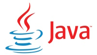

# Home

Java för JIN23

# Välkommen

Välkommen till Campus Mölndals fantastiska elektroniska bok för JIN23. Här hittar du allt du behöver för att komma igång med programmering i Java.

Java är ett objektorienterat programmeringsspråk som utvecklades av Sun Microsystems (numera ägt av Oracle). Det används ofta för att skapa programvaror och plattformar som sträcker sig från små mobila enheter till stora datorsystem. Java har blivit populärt på grund av sin plattformsoberoende natur och förmåga att köra på olika operativsystem.

Java har en enkel och lättförståelig syntax som gör det till ett idealiskt språk för nybörjare. Samtidigt erbjuder det avancerade funktioner och bibliotek för att hantera komplexa program. Generiska typer, anonyma inre klasser, lambda-uttryck och trådhantering är några av de kraftfulla funktionerna som Java erbjuder.

En av de stora fördelarna med Java är dess stora ekosystem av bibliotek och ramverk. Det finns ett brett utbud av bibliotek för att hjälpa till med allt från grafisk användargränssnittsutveckling till databashantering och nätverksprogrammering. Ramverk som Spring och Hibernate förenklar utvecklingsprocessen och främjar goda designmönster.

Java används inom en mängd olika områden, inklusive webbutveckling, mobilapputveckling, spelutveckling och företagsapplikationer. Det är ett mångsidigt språk som ger utvecklare möjlighet att skapa kraftfulla och skalbara program.

Visst är Java cool!? Så låt oss börja!
